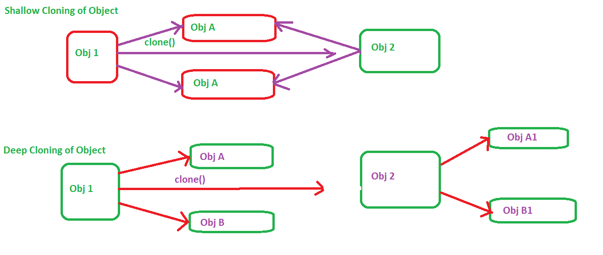

# Java中如何克隆集合——ArrayList和HashSet深拷贝

编程人员经常误用各个集合类提供的拷贝构造函数作为克隆List，Set，ArrayList，HashSet或者其他集合实现的方法。需要记住的是，Java集合的拷贝构造函数只提供浅拷贝而不是深拷贝，这意味着存储在原始List和克隆List中的对象是相同的，指向Java堆内存中相同的位置。增加了这个误解的原因之一是对于不可变对象集合的浅克隆。由于不可变性，即使两个集合指向相同的对象是可以的。字符串池包含的字符串就是这种情况，更改一个不会影响到另一个。使用ArrayList的拷贝构造函数创建雇员List的拷贝时就会出现问题，Employee类不是不可变的。在这种情况下，如果原始集合修改了雇员信息，这个变化也将反映到克隆集合。同样如果克隆集合雇员信息发生变化，原始集合也会被更改。绝大多数情况下，这种变化不是我们所希望的，克隆对象应该与原始对象独立。解决这个问题的方法是深克隆集合，深克隆将递归克隆对象直到基本数据类型或者不可变类。本文将了解一下深拷贝ArrayList或者HashSet等集合类的一种方法。如果你了解深拷贝与浅拷贝之间的区别，那么理解集合深克隆的方法就会很简单。
## Java集合的深克隆
下面例子有一个Employee集合，Employee是可变对象，成员变量name和designation。它们存储在HashSet中。使用java.util.Collection接口的addAll()方法创建集合拷贝。然后修改存储在原始集合每个Employee对象的designation值。理想情况下这个改变不会影响克隆集合，因为克隆集合和原始集合应该相互独立，但是克隆集合也被改变了。修正这个问题的方法是对存储在Collection类中的元素深克隆。  
```Java
import java.util.Collection;
import java.util.HashSet;
import java.util.Iterator;
import org.slf4j.Logger;
import org.slf4j.LoggerFactory;

/**
* Java program to demonstrate copy constructor of Collection provides shallow
* copy and techniques to deep clone Collection by iterating over them.
* @author http://javarevisited.blogspot.com
*/
public class CollectionCloningTest {
    private static final Logger logger = LoggerFactory.getLogger(CollectionCloningclass);
    public static void main(String args[]) {
        // deep cloning Collection in Java
        Collection<Employee> org = new HashSet<>();
        org.add(new Employee("Joe", "Manager"));
        org.add(new Employee("Tim", "Developer"));
        org.add(new Employee("Frank", "Developer"));

        // creating copy of Collection using copy constructor
        Collection<Employee> copy = new HashSet<>(org);

        logger.debug("Original Collection {}", org);
        logger.debug("Copy of Collection {}", copy );

        Iterator<Employee> itr = org.iterator();
        while(itr.hasNext()){
            itr.next().setDesignation("staff");
        }

        logger.debug("Original Collection after modification {}", org);
        logger.debug("Copy of Collection without modification {}", copy );

        // deep Cloning List in Java

    }
}

class Employee {
    private String name;
    private String designation;

    public Employee(String name, String designation) {
        this.name = name;
        this.designation = designation;
    }

    public String getDesignation() {
        return designation;
    }

    public void setDesignation(String designation) {
        this.designation = designation;
    }

    public String getName() {
        return name;
    }

    public void setName(String name) {
        this.name = name;
    }

    @Override
    public String toString() {
        return String.format("%s: %s", name, designation );
    }
}
```
输出：  
```Java
- Original Collection [Joe: Manager, Frank: Developer, Tim: Developer]
- Copy of Collection [Joe: Manager, Frank: Developer, Tim: Developer]
- Original Collection after modification [Joe: staff, Frank: staff, Tim: staff]
- Copy of Collection without modification [Joe: staff, Frank: staff, Tim: staff]
```
可以看到改变原始Collection中Employee对象(改变designation为”staff“)在克隆集合中也有所反映，因为克隆是浅拷贝，指向堆中相同的Employee对象。为了修正这个问题，需要遍历集合，深克隆Employee对象，在这之前，要重写Employee对象的clone方法。  
- 1)Employee实现Cloneable接口
- 2)为Employee类增加下面的clone()方法
```Java
@Override
    protected Employee clone() {
        Employee clone = null;
        try{
            clone = (Employee) super.clone();

        }catch(CloneNotSupportedException e){
            throw new RuntimeException(e); // won't happen
        }

        return clone;
    }
```
- 3)不使用拷贝构造函数，使用下面的代码来深拷贝集合
```java
Collection<Employee> copy = new HashSet<Employee>(org.size());

Iterator<Employee> iterator = org.iterator();
while(iterator.hasNext()){
    copy.add(iterator.next().clone());
}
```
- 4)运行相同的代码更改原始集合，克隆集合不会也被更改。
```Java
- Original Collection after modification  [Joe: staff, Tim: staff, Frank: staff]
- Copy of Collection without modification [Frank: Developer, Joe: Manager, Tim: Developer]
```
可以看到克隆集合和原始集合相互独立，它们指向不同的对象。



这就是Java中如何克隆集合的内容。现在我们知道拷贝构造函数或者List或Set等各种集合类的addAll()方法仅仅创建了集合的浅拷贝，而且原始集合和克隆集合指向相同的对象。为避免这个问题，应该深克隆集合，遍历集合克隆每个元素。尽管这要求集合中的对象必须支持深克隆操作。
  
